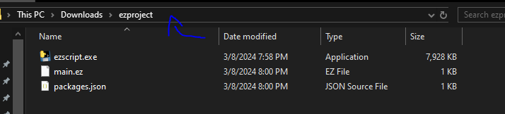

# Starting Out
All EzScript releases are avilable [here](https://github.com/ezscript-html/EzScript-lang/releases) select the latest version and download it.

Note: EzScript only supports Windows version in the releases tab, so for other operating systems you have to build it yourself
  
I recomended using VSCode as your code editor, it is also what i'll be using in this tutorial.
  

Open ezscript.exe and you should see something like this
<br>

<br>
Simpily type 1 and press enter.
<br>
After you have done that drag ezscript.exe into ezproject.
<br>
Now click where the arrow is pointed and type cmd in the box.
<br>

<br>
You should be in command prompt now just type
```
code .
```

Now your in VSCode!